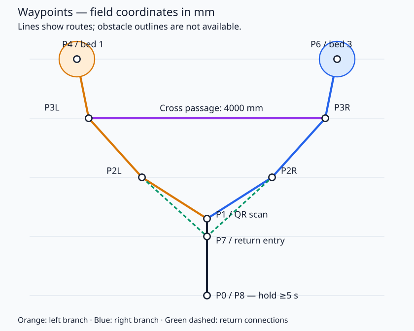

# 医疗送药航点路径规划（轮径 150 mm）

已把给定航点配置到默认 `paths.yaml`，任务状态机按护士台二维码选择先到 1 床或先到 3 床。所有输入坐标按 **mm** 解释，ROS 配置使用 **m**。

## 坐标与车轮

以场地 P0 `(3500, 500) mm` 为 ROS `odom` 原点；启动时车头正对护士台。ROS `+x` 向护士台、`+y` 向左、`yaw=0` 正对护士台：

```text
x_ros = (Y_场地_mm - 500) / 1000
y_ros = (3500 - X_场地_mm) / 1000
```

这同时完成平移、轴向转换和 mm→m 换算，不能仅把原始坐标除以 1000 后直接交给从零启动的里程计。车辆每次启动里程计时应位于 P0，且朝向护士台。

| 航点 | 原始场地坐标（mm） | ROS odom 坐标（m） | 位置容差 |
| --- | --- | --- | --- |
| P0 | (3500, 500) | (0.0, 0.0) | 20 mm |
| P1 | (3500, 1800) | (1.3, 0.0) | 20 mm |
| P2L | (2400, 2500) | (2.0, 1.1) | 50 mm |
| P2R | (4600, 2500) | (2.0, -1.1) | 50 mm |
| P3L | (1500, 3500) | (3.0, 2.0) | 50 mm |
| P3R | (5500, 3500) | (3.0, -2.0) | 50 mm |
| P4 | (1300, 4500) | (4.0, 2.2) | 20 mm |
| P6 | (5700, 4500) | (4.0, -2.2) | 20 mm |
| P7 | (3500, 1500) | (1.0, 0.0) | 30 mm |
| P8 | (3500, 500) | (0.0, 0.0) | 20 mm |

轮径 `150 mm`，轮半径 `0.075 m`，周长约 `0.47124 m`。平移速度上限暂设 `0.25 m/s`，纯轴向平移时对应驱动轮约 `31.83 RPM`；四全向轮各自转速由现有运动学分配，不应给所有轮相同的转速。轮心到底盘中心距离仍为旧值 `0.18 m`，需要实测，轮径不能确定这个距离。

## 路线



示意图按原始场地坐标绘制，只表示航点连线；未绘制未提供尺寸的护士台和病床轮廓。

首位为 1（二维码 11、13）：

```text
P0 → P1 [扫描]
   → P2L → P3L → P4 [完成 1 床任务]
   → P3L → P3R → P6 [完成 3 床任务]
   → P3R → P2R → P7 → P8 [静止 ≥5 s]
```

首位为 3（二维码 31、33）：

```text
P0 → P1 [扫描]
   → P2R → P3R → P6 [完成 3 床任务]
   → P3R → P3L → P4 [完成 1 床任务]
   → P3L → P2L → P7 → P8 [静止 ≥5 s]
```

| 任务段 | 首位 1 使用的路径名 | 首位 3 使用的路径名 |
| --- | --- | --- |
| 起点到护士台 | `nurse_station` | `nurse_station` |
| 护士台到第一张床 | `bed1_circle` | `bed3_circle` |
| 两床之间 | `bed1_to_bed3` | `bed3_to_bed1` |
| 最后一张床返回 | `bed3_to_home` | `bed1_to_home` |

二维码第二位只决定第一次开哪个药箱，第二次开另一个药箱，不参与选路。两条分支对称，航点折线总长均约 `15.86 m`；以 `0.25 m/s` 匀速计算至少约 `63.4 s`，实际还包括比例减速、到点保持、扫码、放药与回归保持。导航阶段超时设为 `75 s`，其余阶段 `30 s`，总任务超时仍为 `180 s`。

车辆只有前、左、右三路测距，因此 `mission_complete.launch` 默认使用 `path_tracker_forward_only.yaml`：先转向下一段，再向车头正向前进，离床时也先掉头。航点顺序和坐标不变。只在起点、护士台和床旁保留 `yaw: 0.0`；中间点及回归停止点不强制重新朝向护士台，避免无用旋转。床旁相机、机械臂需要的实际朝向尚未提供，实测后应调整 P4/P6 的 yaw。

原 `path_tracker.yaml` 的全向平移模式仍可选择，但离床倒退会被安全节点以 `REAR_UNOBSERVED` 拦停。只有接入真实、有效且新鲜的后向 `sensor_msgs/Range` 数据，才可能通过倒退检查；不能用固定距离伪造后方净空。前进模式的掉头也需要现场检查车体、收拢机械臂的整个转弯扫掠区域，三束测距不能证明后方旋转净空。

## 停靠与现场确认

P4、P6 的圆半径均为 `0.3 m`。车体（不含机械臂）必须满足：

```text
车体中心到圆心的距离 + 车体投影外接半径 + 边界余量 ≤ 0.3 m
```

当前车体投影半径 `0.20 m`、余量 `0.02 m` 为项目旧默认值，对应中心误差上限 `0.08 m`；路径终点容差 `0.02 m`。必须按车体真实外形量取投影半径；矩形车体可用 `sqrt(长²+宽²)/2` 保守估计，尺寸应包含车轮等凸出部件。150 mm 轮径无法确定整车能否装入圆圈。

回归检测使用含机械臂的整机投影半径，默认 `0.25 m`，并要求里程计线速度不超过 `0.01 m/s`、角速度不超过 `0.02 rad/s` 连续满 `5 s`；位置或速度越界会重新计时。白色内框尺寸未提供，配置暂保留旧的 `0.6 m × 0.6 m` 方框，需将 `home_zone_vertices` 改为实测内边界。

给定圆心是近似值。应现场核对圆心距床头柜 500 mm、距病床侧面 300 mm，并检查车辆外轮廓扫过的整个路线：尤其是 P1→P2L/P2R 的斜线、P3L↔P3R 横向通道，以及 P2L/P2R→P7 的回程斜线。缺少障碍物轮廓和整车尺寸，当前连线无法证明净空符合要求。

当前默认路线用于 `odom` 跟踪。若启用动态导航的 `map` 模式，需要先确保地图原点与轴向采用相同约定，并把机器人在地图中的初始位姿设为 P0；否则应提供单独的 map 坐标路线文件。

微调的前向测距目标改为保守初值 `400 mm`，原 `200 mm` 与至少 `300 mm` 的安全制动阈值冲突。它是传感器到所测障碍物的距离，与圆心到床头柜的 `500 mm` 不同，必须按传感器实际位置、朝向和床旁目标标定。目标与制动阈值、速度及释放余量冲突时，启动服务会明确失败。

微调速度上限保持 `0.05 m/s`，全局 `0.25 m/s` 只作为上限约束，不会覆盖它；一步内保持同一方向和速度。单次微调相对起点的最大平移距离为 `50 mm`，超时 `25 s`，且要求测距及里程计持续新鲜。只有进入距离容差才发布成功；超时、步数耗尽、位移越界、数据过期或需要无后向保护的倒退均报告失败并停车，任务不会继续开箱放药。微调结束后任务仍检查整车投影是否在停靠圆内。

任务全局超时后取消全部任务动作、锁住底盘并原地停止，不会按计划的最后一张床盲选返程路线。阶段失败同样停止。正常床旁锁车只发布底盘锁定，正常完成也不触发 `/stop_all`；`/stop_all` 保留给真实故障，由健康监控转为锁存急停。

导航目标、微调和执行器均接收任务取消。开箱、机械臂、语音等服务异步等待，取消和超时回调可继续处理；过期服务结果不会推进新任务。机械臂及开箱等待可中断，取消时软件尝试发送机械臂停止和舵机关闭指令，不自动收臂；实际停止效果仍需检查 STM32 接收、执行与机械惯性。取消后的动作服务会拒绝迟到请求，只有任务控制器接受新的启动后才重新允许动作。急停复位本身保持底盘锁定，也不恢复旧路径。新任务开始前应人工将车辆恢复到 P0 的规定初始位姿。

前进路线增加转向时间。180 秒总限制保持不变，理想运动学仿真不含真实开箱、放药、语音时长或障碍等待；必须实测整轮耗时，不应通过增大任务时限来代替比赛计时验证。

跟踪器的比例位置控制本身会在接近终点时降速，已去掉原先再乘一次距离的重复减速，避免 20 mm 容差航点附近长时间爬行。平移速度上限仍为 `0.25 m/s`，速度仲裁器仍限制加速度。

## 编译与测试

涉及路径跟踪器和任务控制器代码变更，使用前需编译：

```bash
cd /home/fire/ros_ws
catkin_make
source devel/setup.bash
```

无硬件回归测试：

```bash
rostest path_manager path_tracker_holonomic.test
rostest path_manager path_tracker_transitions.test
rostest robot_navigation mission_routes.test
rostest robot_navigation safety_and_fine_tuning.test
rostest robot_navigation mission_cancellation.test
rostest robot_navigation mission_closed_loop.test
rostest arm_and_gripper arm_cancellation.test
rostest robot_navigation box_cancellation.test
```

跟踪测试覆盖横移、倒退、坐标旋转、速度限制、终点朝向、急停/取消、复位不续跑和里程计过期。任务路线测试运行真实状态机与健康监控、模拟导航和任务服务，覆盖 11/13/31/33 的选路与药箱分配、车体投影越界拦截、回归静止满 5 秒及专用返程路径缺失。

防撞与微调测试使用真实速度仲裁、防撞和微调节点，检查持续拦停、稳定警戒减速、左右方向保护、无后向数据禁止倒退，以及微调成功/失败条件。取消测试检查慢服务期间及时停止、迟到结果忽略、阶段超时和中途全局超时。执行器测试向真实控制器注入内存 CAN 记录器，检查取消会输出停止/关闭帧，且复位后不续跑；不会打开真实 CAN 接口。

完整闭环测试使用真实路径管理、前进跟踪、速度仲裁、防撞、微调、任务和健康监控节点，模拟理想里程计与三路测距，开箱、放药、语音服务为模拟。它验证两条分支可以完整运行，不能证明地面净空、轮胎打滑误差、真实传感器标定或执行器物理停止效果。

2026-10-08 验证结果：相关控制节点和执行器测试目标在独立临时目录完成 catkin 编译；上述 8 个 ROS 测试套件全部通过（9 个测试用例），另外 CAN 默认配置的 5 项检查、音视频启动配置的 13 项检查通过。最终前进模式闭环仿真两分支分别用时约 `129.65 s`、`131.05 s`，业务执行器为即时模拟服务，不能作为实车比赛耗时保证。测试未启动生产硬件栈，未发送实际 CAN 帧。

正常任务入口仍为 `roslaunch robot_navigation mission_complete.launch`，路径文件默认已指向更新后的 `robot_bringup/config/paths.yaml`。临时构建仅用于验证；实车使用前需按上面的命令重新编译工作空间并加载 `devel/setup.bash`。
